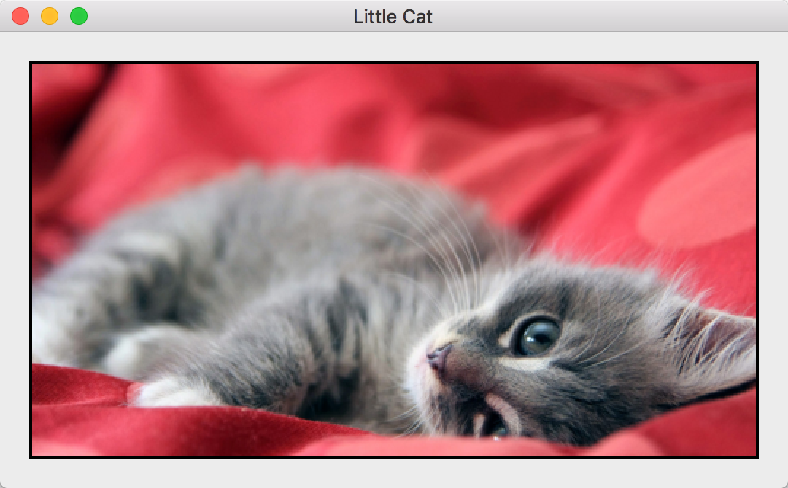
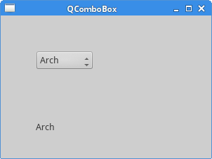

# 控件2

本章我们继续介绍PyQt5控件。这次的有`QPixmap`，`QLineEdit`，`QSplitter`，和`QComboBox`。

## 图片

`QPixmap`是处理图片的组件。本例中，我们使用`QPixmap`在窗口里显示一张图片。

```python
#!/usr/bin/python3
# -*- coding: utf-8 -*-

"""
ZetCode PyQt5 tutorial 

In this example, we dispay an image
on the window. 

Author: Jan Bodnar
Website: zetcode.com 
Last edited: August 2017
"""

from PyQt5.QtWidgets import (QWidget, QHBoxLayout, 
    QLabel, QApplication)
from PyQt5.QtGui import QPixmap
import sys

class Example(QWidget):
    
    def __init__(self):
        super().__init__()
        
        self.initUI()
        
        
    def initUI(self):      

        hbox = QHBoxLayout(self)
        pixmap = QPixmap("redrock.png")

        lbl = QLabel(self)
        lbl.setPixmap(pixmap)

        hbox.addWidget(lbl)
        self.setLayout(hbox)
        
        self.move(300, 200)
        self.setWindowTitle('Red Rock')
        self.show()        
        
        
if __name__ == '__main__':
    
    app = QApplication(sys.argv)
    ex = Example()
    sys.exit(app.exec_())
```

```
pixmap = QPixmap("redrock.png")
```
创建一个`QPixmap`对象，接收一个文件作为参数。

```
lbl = QLabel(self)
lbl.setPixmap(pixmap)
```
把`QPixmap`实例放到`QLabel`组件里。

程序展示：



## 行编辑

`QLineEdit`组件提供了编辑文本的功能，自带了撤销、重做、剪切、粘贴、拖拽等功能。

```python
#!/usr/bin/python3
# -*- coding: utf-8 -*-

"""
ZetCode PyQt5 tutorial 

This example shows text which 
is entered in a QLineEdit
in a QLabel widget.
 
Author: Jan Bodnar
Website: zetcode.com 
Last edited: August 2017
"""

import sys
from PyQt5.QtWidgets import (QWidget, QLabel, 
    QLineEdit, QApplication)


class Example(QWidget):
    
    def __init__(self):
        super().__init__()
        
        self.initUI()
        
        
    def initUI(self):      

        self.lbl = QLabel(self)
        qle = QLineEdit(self)
        
        qle.move(60, 100)
        self.lbl.move(60, 40)

        qle.textChanged[str].connect(self.onChanged)
        
        self.setGeometry(300, 300, 280, 170)
        self.setWindowTitle('QLineEdit')
        self.show()
        
        
    def onChanged(self, text):
        
        self.lbl.setText(text)
        self.lbl.adjustSize()        
        
        
if __name__ == '__main__':
    
    app = QApplication(sys.argv)
    ex = Example()
    sys.exit(app.exec_())
```
例子中展示了一个编辑组件和一个标签，我们在输入框里键入的文本，会立即在标签里显示出来。

```
qle = QLineEdit(self)
```
创建一个`QLineEdit`对象。

```
qle.textChanged[str].connect(self.onChanged)
```
如果输入框的值有变化，就调用`onChanged()`方法。

```
def onChanged(self, text):
    
    self.lbl.setText(text)
    self.lbl.adjustSize() 
```
在`onChanged()`方法内部，我们把文本框里的值赋值给了标签组件，然后调用`adjustSize()`方法让标签自适应文本内容。

程序展示：


## QSplitter

`QSplitter`组件能让用户通过拖拽分割线的方式改变子窗口大小的组件。本例中我们展示用两个分割线隔开的三个`QFrame`组件。

```python
#!/usr/bin/python3
# -*- coding: utf-8 -*-

"""
ZetCode PyQt5 tutorial 

This example shows
how to use QSplitter widget.
 
Author: Jan Bodnar
Website: zetcode.com 
Last edited: August 2017
"""

from PyQt5.QtWidgets import (QWidget, QHBoxLayout, QFrame, 
    QSplitter, QStyleFactory, QApplication)
from PyQt5.QtCore import Qt
import sys

class Example(QWidget):
    
    def __init__(self):
        super().__init__()
        
        self.initUI()
        
        
    def initUI(self):      

        hbox = QHBoxLayout(self)

        topleft = QFrame(self)
        topleft.setFrameShape(QFrame.StyledPanel)
 
        topright = QFrame(self)
        topright.setFrameShape(QFrame.StyledPanel)

        bottom = QFrame(self)
        bottom.setFrameShape(QFrame.StyledPanel)

        splitter1 = QSplitter(Qt.Horizontal)
        splitter1.addWidget(topleft)
        splitter1.addWidget(topright)

        splitter2 = QSplitter(Qt.Vertical)
        splitter2.addWidget(splitter1)
        splitter2.addWidget(bottom)

        hbox.addWidget(splitter2)
        self.setLayout(hbox)
        
        self.setGeometry(300, 300, 300, 200)
        self.setWindowTitle('QSplitter')
        self.show()
        
        
    def onChanged(self, text):
        
        self.lbl.setText(text)
        self.lbl.adjustSize()        
        
        
if __name__ == '__main__':
    
    app = QApplication(sys.argv)
    ex = Example()
    sys.exit(app.exec_())
```
三个窗口和两个分割线的布局创建完成了，但是要注意，有些主题下，分割线的显示效果不太好。

```
topleft = QFrame(self)
topleft.setFrameShape(QFrame.StyledPanel)
```
为了更清楚的看到分割线，我们使用了设置好的子窗口样式。

```
splitter1 = QSplitter(Qt.Horizontal)
splitter1.addWidget(topleft)
splitter1.addWidget(topright)
```
创建一个`QSplitter`组件，并在里面添加了两个框架。

```
splitter2 = QSplitter(Qt.Vertical)
splitter2.addWidget(splitter1)
```
也可以在分割线里面再进行分割。

程序展示：


## 下拉选框

`QComboBox`组件能让用户在多个选择项中选择一个。

```python
#!/usr/bin/python3
# -*- coding: utf-8 -*-

"""
ZetCode PyQt5 tutorial 

This example shows how to use 
a QComboBox widget.
 
Author: Jan Bodnar
Website: zetcode.com 
Last edited: August 2017
"""

from PyQt5.QtWidgets import (QWidget, QLabel, 
    QComboBox, QApplication)
import sys

class Example(QWidget):
    
    def __init__(self):
        super().__init__()
        
        self.initUI()
        
        
    def initUI(self):      

        self.lbl = QLabel("Ubuntu", self)

        combo = QComboBox(self)
        combo.addItem("Ubuntu")
        combo.addItem("Mandriva")
        combo.addItem("Fedora")
        combo.addItem("Arch")
        combo.addItem("Gentoo")

        combo.move(50, 50)
        self.lbl.move(50, 150)

        combo.activated[str].connect(self.onActivated)        
         
        self.setGeometry(300, 300, 300, 200)
        self.setWindowTitle('QComboBox')
        self.show()
        
        
    def onActivated(self, text):
      
        self.lbl.setText(text)
        self.lbl.adjustSize()  
        
                
if __name__ == '__main__':
    
    app = QApplication(sys.argv)
    ex = Example()
    sys.exit(app.exec_())
```
本例包含了一个`QComboBox`和一个`QLabel`。下拉选择框有五个选项，都是Linux的发行版名称，标签内容为选定的发行版名称。

```
combo = QComboBox(self)
combo.addItem("Ubuntu")
combo.addItem("Mandriva")
combo.addItem("Fedora")
combo.addItem("Arch")
combo.addItem("Gentoo")
```
创建一个`QComboBox`组件和五个选项。

```
combo.activated[str].connect(self.onActivated) 
```
在选中的条目上调用`onActivated()`方法。

```
def onActivated(self, text):
  
    self.lbl.setText(text)
    self.lbl.adjustSize() 
```
在方法内部，设置标签内容为选定的字符串，然后设置自适应文本大小。

程序展示：

